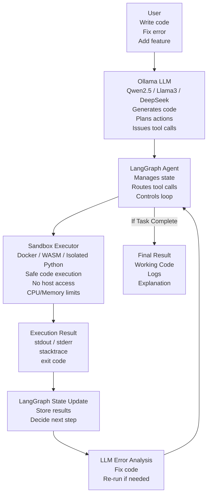

```mermaid
flowchart TD

    %% User
    A[User\nWrite code\nFix error\nAdd feature] --> B

    %% LLM
    B[Ollama LLM\nQwen2.5 / Llama3 / DeepSeek\nGenerates code\nPlans actions\nIssues tool calls] --> C

    %% LangGraph
    C[LangGraph Agent\nManages state\nRoutes tool calls\nControls loop] --> D

    %% Sandbox
    D[Sandbox Executor\nDocker / WASM / Isolated Python\nSafe code execution\nNo host access\nCPU/Memory limits] --> E

    %% Execution Output
    E[Execution Result\nstdout / stderr\nstacktrace\nexit code] --> F

    %% LangGraph Updates
    F[LangGraph State Update\nStore results\nDecide next step] --> G

    %% LLM Feedback Loop
    G[LLM Error Analysis\nFix code\nRe-run if needed] --> C

    %% Back to user on success
    C -->|If Task Complete| H[Final Result\nWorking Code\nLogs\nExplanation]

```